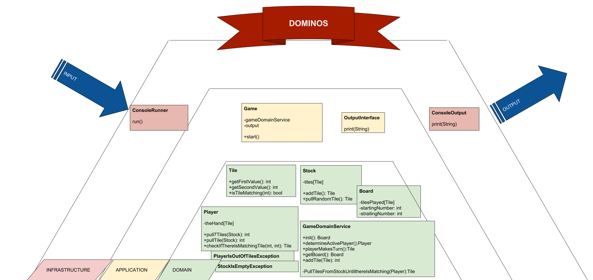

# dominos

Dominoes is a family of games played with rectangular tiles. Each tile is divided into two square ends. Each end is marked with a number (one to six) of spots or is blank. There are 28 tiles, one for each combination of spots and blanks (see image).
Write a program which allows two players to play Dominoes against each other:

# rules

- The 28 tiles are shuffled face down and form the stock. 
- Each player draws seven tiles. 
- Pick a random tile to start the line of play.
- The players alternately extend the line of play with one tile at one of its two ends;
- A tile may only be placed next to another tile, if their respective values on the connecting ends are identical.
- If a player is unable to place a valid tile, they must keep on pulling tiles from the stock until they can.
- The game ends when one player wins by playing their last tile.

# commands

`composer run`  -- run the game

`composer test` -- run the test suite

`composer test:coverage` -- generage coverage report. Will be located at `var/test-coverage/index.html`
